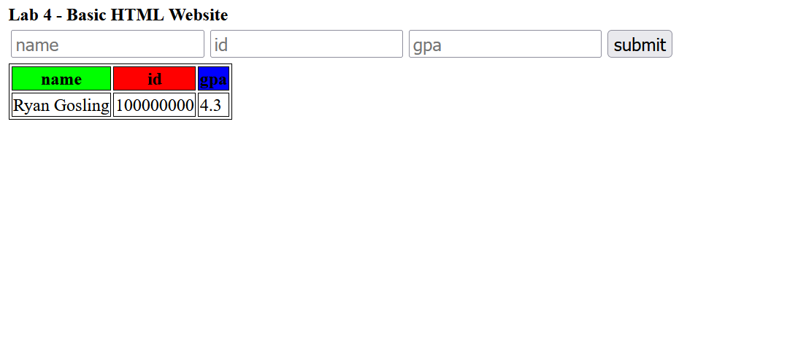

# Lab 4 - Basic HTML Website

>Course: CSCI 2020U: Software Systems Development and Integration

## Overview

This lab is meant to get you familiar with HTML, CSS & JS along with some basic concepts.

>All you need for this lab is a web browser and to access your work
>simply open the HTML file in your browser.

## Lab Work

You are going to create an interactive website where the user can add records to a `<table>` element in an HTML page.

After you are done, your page should look like below:

>Note that all HTML ids and CSS class names should be lowercase, this is for the sake of autograding
>and mostly popular convention.

### HTML

Within the `<table>` that is given to you in the `index.html` file, you are to do
the following:

1. add a table header which contains the following columns in the following order:
  - name
  - id
  - gpa
2. give this `<table>` the `id` of `chart`

Above this `<table>`, there should be three `<input>` elements along with a `<button>` element within a `
` tag.
This how the user is going to add data into the `<table>`, they will need `<input>`s to enter the following data:

- name
- id
- gpa

Each `<input>` should have `id` and `placeholder` attributes that reflect what they do on the page
(e.g., the `<input>` for `name` should have `id="name"` and `placeholder="name"`).

The button should be left of the `<input>` tags and should have the `id` of `submit`.
You will also need to add the `onclick` attribute to the element and bind it to
`add_record()`, the javascript function you will implement.

### JS

>In order to run the javascript in your webpage, you will need to include a
>`<script>` tag within the `<head>` of your HTML document.

As mentioned above, the `submit` button should have an `onclick` handler that's
bound to the `add_record()` function within the `js/main.js` file.

Your job is to implement the rest of the function. In the end, it should do this:

- parse the data from the `<input>` tags
  - this should check if any of the values are `""`, if so it should do nothing
- for each parsed value, wrap it in `<td>` tags
- concatenate all the `<td>` tags and wrap those in a `<tr>`
- finally, add this `<tr>` to the `innerHTML` of the `<tbody>` of the `<table>`

You are appending a string object to the `innerHTML` of a special class within javascript,
this works because ultimately, HTML is just plaintext.

>As a bonus, you could implement code which sets the `value` of each `<input>` to
>null or `undefined` after the function call.

### CSS

>In order to include the classes and ids from your CSS file you will
>need to include a `<link>` tag within the `<head>` of your document.

Here you are going to do some styling of the elements.
In the file `css/styles.css`, you will create the following classes:

- `green`
- `red`
- `blue`
- `row`

The `<table>`'s headers should have the following classes:

- `name` should have the class `green`
- `id` should have the class `red`
- `gpa` should have the class `blue`

The `green`, `red` and `blue` classes should change the `background-color`
to their respective color (e.g., `blue` should be `#0000ff`).

>You can use either RGB (255, 0, 0) values or hex (#ff0000) values.

The `
` that contains the buttons and input tags should have a class called `row`.
This should be a flexbox whose `direction` is `row`.

>If you are having any trouble with this lab contact your TA.
