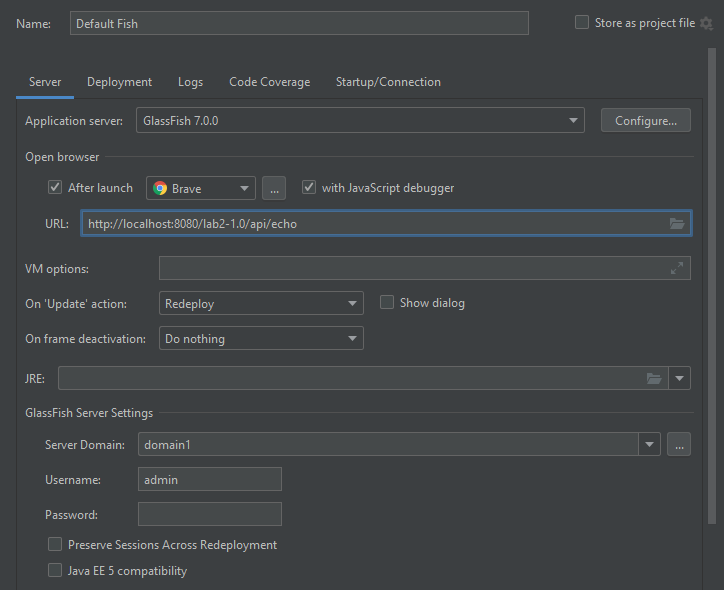

# Lab 2 - Basic Java Web Server

>Course: CSCI 2020U: Software Systems Development and Integration

[](https://git-scm.com)

## Overview

This lab is meant to get you familiar with developing Java using the IntelliJ IDE and using a webserver, in this case we are going to be using [GlassFish](https://projects.eclipse.org/projects/ee4j.glassfish/downloads).

## Prerequisites

> !! **IMPORTANT** !!

1. For this and future labs you will need the *ultimate version* of IntelliJ IDEA. You can obtain the ultimate version via. an educational discount, see [here](https://www.jetbrains.com/community/education/#students).
2. You will need to download & install the *full profile* version of [GlassFish](https://projects.eclipse.org/projects/ee4j.glassfish/downloads).
	- Unzip the file and copy it somewhere (e.g., Program Files), you need to remember where you install it.
3. You will need to create a GlassFish configuration for your Java projects, you don't need to do this immediately but for testing and running the lab you will need to do so.
	- See [Demo: RestHelloWorld](https://learn.ontariotechu.ca/courses/21839/pages/module-2-build-tools-+-resthelloworld?module_item_id=500370) in Canvas (around the 9:30 mark) on how to create this configuration.
4. You will need to `clone` this lab to your machine and install...
	- any Java related binaries
	- the project's [dependencies](https://www.jetbrains.com/help/idea/work-with-maven-dependencies.html#maven_import_dependency)

>If there is any trouble contact your TA to have them help you resolve this.

## Lab Work

Here you will implement a couple of functions in the `EchoResource` class in the `EchoResource.java` file that deal with URL parsing (`@Path`), see function declarations below:

- `String main();`
- `String unary(String arg);`
- `String binary(String arg_a, String arg_b);`

These functions should...

- return a `String` with the arguments (if any) included within the result
- be callable from your GlassFish server
	- e.g., if I go to `/api/some/thing` the `some` and `thing` should be passed as arguments to the `String binary(String arg_a, String arg_b);` function.
- use the `GET` HTTP method
- produce a `"text/plain"` response

>See the lecture notes or ask a TA for help.

## Accessing Your Website

>The default URL for the application is `localhost:8080/lab2-1.0/api/echo` but this won't work until you implement the functions above.

When running your code via. IntelliJ you might see that your browser (if it does automatically pop-up) doesn't automatically go to your website. This is most likely because you haven't defined it within the GlassFish configuration for this project.

[](./config.png)

The URL of the application is as follows (formed from a variety of local files):

```
localhost:8080/{artifactId}-{version}/{applicationRoot}/...
```
