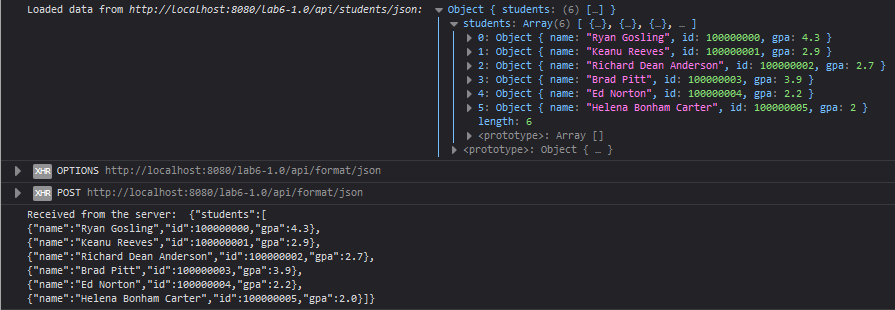

# Website

In the end, your website should look like this:

Website:

[](index.html)

Console:

[](js/main.js)

>Note that the autograding tests from the previous labs apply to this one,
>make sure your lab passes these tests.

## Modifications

Here, you'll need to create three buttons, all of which make a POST request to three new API endpoints you'll create:

1. the `To JSON` button will make a request to `/api/format/json`
2. the `To CSV` button will make a request to `/api/format/csv`
3. the `To XML` button will make a request to `/api/format/xml`

In the `body` of this request, you'll input the **entire** `table#chart` element. This will be sent to the backend for data processing.

>Since all of these buttons essentially do the same thing, it would be a good idea to make a function which takes a URL as an input and sends a request to that URL.

### HTML

Create *another* `<div class="row">` object after the first one that contains your three buttons.  
The buttons should have the ids:

1. `to_csv`
2. `to_xml`
3. `to_json`

### JS

For each new `<button>` tag created, you'll need to assign the `onclick` attribute to a function.  
Here's some sample code for this function:

```js
function post_to_server(endpoint, contentType) {

  // setting the url
  const url = "http://localhost:8080/lab6-1.0/api/format/" + endpoint;

  // getting the payload
  const payload = document.getElementById("chart").innerHTML;

  /// creating a response to the server
  const request = new XMLHttpRequest();
  request.open("POST", url);                              // setting the method
  request.setRequestHeader("Content-Type", "text/html");  // setting the sending content-type
  request.setRequestHeader("Accept", contentType);        // setting the receiving content-type

  // on response handler
  request.onload = () => {
    if (request.status !== 200) {
      console.error("Something went wrong went contacting the server");
      return
    }
    console.log("Received from the server: ", request.responseText) // this contains the received payload

    /**
     * this is how to programmatically download something in javascript.
     * 1. create an invisible anchor tag
     * 2. set the href attribute (contains file data)
     * 3. set the download attribute (contains the file name)
     * 4. click it
     */
    var element = document.createElement('a');
    element.setAttribute('href', `data:${contentType};charset=utf-8,` + encodeURIComponent(request.responseText));
    element.setAttribute('download', `students.${endpoint}`);
    element.click();
  }

  // sending the payload to the server
  request.send(payload);
}
```
