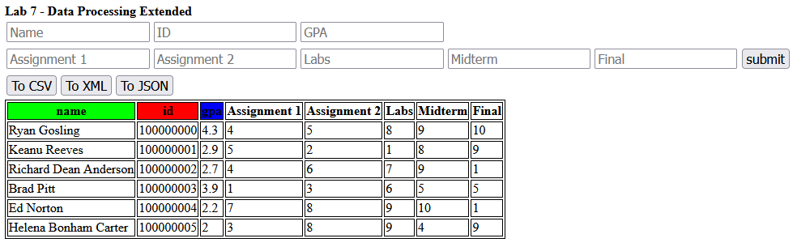
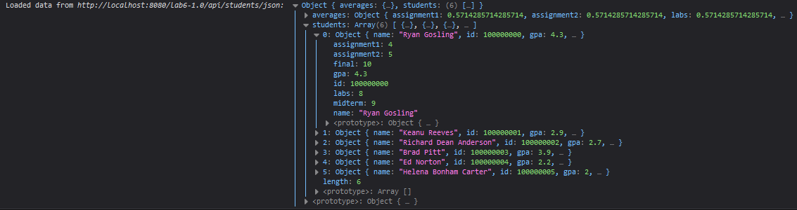

# Client Extension

In the end, your website should look similar to this website.

Website:

[](index.html)

Console:

[](js/main.js)

## Lab Work

You should notice that if we change the structure the data you've used for the past 3 labs, it would become invalid.
Therefore, we'll need to extend the functionality of the javascript and display properties of the HTML.

For your sake, I've included the updated `student.*` files in `src/main/resources/`.

### Extending the HTML structure

Here, you will create:

1. another set of inputs wrapped within a `<div class="row">` tag.
2. move the `<button id="submit">` element into this new `<div>`
3. add five new `<th>` elements for each thing to grade

See sample code below:

```html
<div class="row">
    <!-- buttons for id, gpa and name --->
</div>
<div class="row">
    <input placeholder="Assignment 1" id="assignment1" />
    <input placeholder="Assignment 2" id="assignment2" />
    <input placeholder="Labs" id="labs" />
    <input placeholder="Midterm" id="midterm" />
    <input placeholder="Final" id="final" />
    <button id="submit" onclick="add_record()">submit</button>
</div>
<div class="row">
    <!-- buttons that format from lab 6 --->
</div>
<table id="chart">
    <thead>
    <tr>
        <!-- previous <th> elements from lab 4 --->
        <!-- new table headers for lab 6 --->
        <th>Assignment 1</th>
        <th>Assignment 2</th>
        <th>Labs</th>
        <th>Midterm</th>
        <th>Final</th>
    </tr>
    </thead>
    <tbody></tbody>
</table>
```

>Note that the IDs are case-sensitive and the `<th>` elements should appear in this order (tested as lowercase)

### Extending the Javascript functionality

Since you've added five new `<input>` tags, you'll need to extend the functionality of the function (usually `add_record()`) which adds data to your `<table id="chart">`.

#### Data Correction

In the case that the data is *invalid* or is missing fields, you should assign default values:

- name should be assigned an empty string or some default name
- ID should be assigned `100 000 000`
- GPA should be assigned `0`
- Assignment 1 should be assigned `0`
- Assignment 2 should be assigned `0`
- Labs should be assigned `0`
- Midterm should be assigned `0`
- Final should be assigned `0`

In practice, default values aren't inherently bad but in some cases they are, they can sometimes signify that something in the process went wrong.

#### A Note On Scalability

As software developers, you should think smarter not harder yet also plan for your application growing in size (this is called scalability, essentially how large can this application grow?).

It is not required, but it is recommended that instead of having two variables which store the reference to the HTML element and the other the value, you use an array which contains the IDs of the elements you want to pull from.
See example below:

```js
const refs = ["name", "id", "gpa"].map((id) => {
    return document.getElementById(id);
});
```
